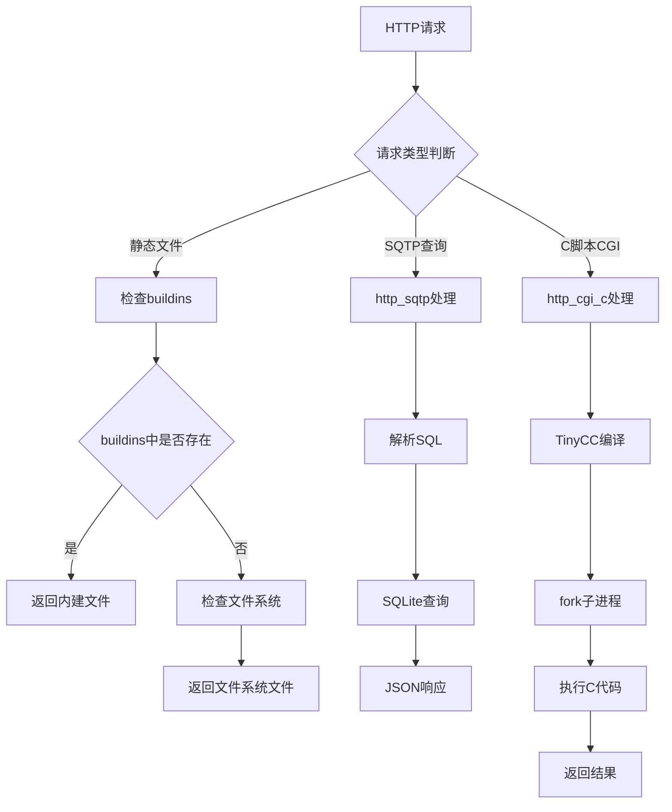
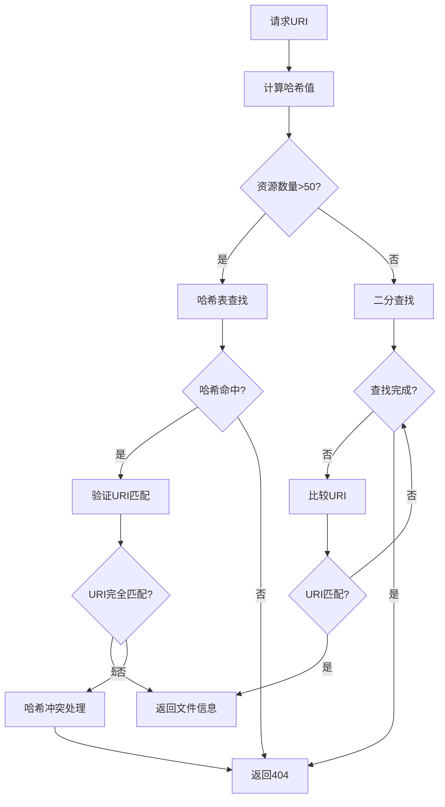

# WPP 网络编程平台架构设计

## 概述

WPP (Web Programming Platform) 是一个集成的Web服务器平台，提供HTTP服务、动态C代码编译执行、结构化查询传输协议(SQTP)、虚拟文件系统等功能。整个架构设计采用模块化组件，支持零配置启动和开发调试。

## 系统架构图

```
┌─────────────────────────────────────────────────────────────┐
│                     WPP 网络编程平台                          │
├─────────────────────────────────────────────────────────────┤
│  客户端接入层                                                │
│  ┌─────────────┐  ┌─────────────┐  ┌─────────────┐         │
│  │   Browser   │  │     cURL    │  │ JS Client   │         │
│  │   (HTML)    │  │   (SQTP)    │  │ (fetch API) │         │
│  └─────────────┘  └─────────────┘  └─────────────┘         │
├─────────────────────────────────────────────────────────────┤
│  协议层                                                     │
│  ┌─────────────┐  ┌─────────────┐  ┌─────────────┐         │
│  │    HTTP     │  │    SQTP     │  │     CGI     │         │
│  │   Server    │  │  Protocol   │  │   C Scripts │         │
│  │  (httpd.*)  │  │(http_sqtp.*)│  │(http_cgi_*.*)│        │
│  └─────────────┘  └─────────────┘  └─────────────┘         │
├─────────────────────────────────────────────────────────────┤
│  核心服务层                                                  │
│  ┌─────────────┐  ┌─────────────┐  ┌─────────────┐         │
│  │   TinyCC    │  │  VFile Sys  │  │   Buildins  │         │
│  │ Environment │  │   (vfile)   │  │ Virtual FS  │         │
│  │ (tcc_evn)   │  │             │  │ (buildins)  │         │
│  └─────────────┘  └─────────────┘  └─────────────┘         │
├─────────────────────────────────────────────────────────────┤
│  第三方集成层                                               │
│  ┌─────────────┐  ┌─────────────┐  ┌─────────────┐         │
│  │   SQLite    │  │   TinyCC    │  │    zlib     │         │
│  │  Database   │  │  Compiler   │  │ Compression │         │
│  └─────────────┘  └─────────────┘  └─────────────┘         │
│  ┌─────────────┐  ┌─────────────┐                          │
│  │   yyjson    │  │   uthash    │                          │
│  │ JSON Parser │  │ Hash Tables │                          │
│  └─────────────┘  └─────────────┘                          │
├─────────────────────────────────────────────────────────────┤
│  系统基础层                                                  │
│  ┌─────────────┐  ┌─────────────┐  ┌─────────────┐         │
│  │   Common    │  │   Build     │  │   Main      │         │
│  │  Utilities  │  │   System    │  │   Entry     │         │
│  │  (common)   │  │ (Make/CMake)│  │  (main.c)   │         │
│  └─────────────┘  └─────────────┘  └─────────────┘         │
└─────────────────────────────────────────────────────────────┘
```

## 核心组件详解

### 1. HTTP 服务器核心 (`httpd.h` / `httpd.c`)

**职责**：
- HTTP/1.1协议解析和响应
- 静态文件服务
- Range请求支持
- 路由分发
- 进程管理和PID控制

**关键特性**：
- 基于althttpd修改优化
- 支持TLS加密 (通过`ENABLE_TLS`宏控制)
- 集成buildins虚拟文件系统
- 自适应缓存控制 (ETag/Last-Modified)

**接口设计**：
```c
typedef struct http_params {
    const char* csRoot;        // 网站根目录
    const char* csLogFile;     // 日志文件路径  
    uint32_t iMxAge;          // 缓存控制时长
    uint32_t iMaxCpu;         // CPU时间限制
    uint32_t iMxChild;        // 最大子进程数
    bool bEnableSAB;          // SharedArrayBuffer支持
    bool bUseTimeout;         // 超时机制
} http_params_st;
```

### 2. 虚拟文件系统 (`buildins.h` / `buildins.c`)

**设计目标**：
- 将文件系统资源编译到二进制中 (Sysroot概念)
- 提供类似文件系统的API接口
- 支持目录结构和元数据
- 零外部依赖启动

**核心数据结构**：
```c
// 文件信息
typedef struct buildin_file_info {
    struct buildin_file_info* next;    // 链表指针
    uint32_t id;                       // URI哈希ID
    const char* uri;                   // 资源路径 
    const char* mime;                  // MIME类型
    const uint8_t* data;               // 文件数据
    const uint8_t* compressed;         // gzip压缩数据
    size_t size;                       // 原始大小
    size_t compressed_size;            // 压缩后大小
    time_t mtime;                      // 修改时间
} buildin_file_info_st;

// 目录信息  
typedef struct buildin_dir_info {
    struct buildin_file_info* next;    // 下一节点
    uint32_t id;                       // 目录ID
    const char* uri;                   // 目录路径
    struct buildin_dir_info* parent;   // 父目录
    const uint8_t* flag;               // 目录标识 (-1)
} buildin_dir_info_st;
```

**哈希优化**：
- 自适应哈希表：资源数量 > 50时启用
- 深度控制：单桶深度 > 3时重构
- 负载因子：保持0.3以上避免过度碰撞

### 3. TinyCC 集成环境 (`tcc_evn.h` / `tcc_evn.c`)

**设计理念**：
- fork-friendly预配置：主进程预载配置，子进程继承
- 虚拟文件系统集成：拦截include路径，从buildins提供
- API符号注入：内置SQLite/zlib函数符号

**核心流程**：
```c
// 1. 环境初始化 (主进程)
int tcc_evn_init(void);

// 2. 编译器配置 (子进程)  
int tcc_configure(TCCState *s);

// 3. 资源清理
void tcc_evn_cleanup(void);
```

**文件系统集成**：
- 通过`tcc_set_file_callback`拦截文件访问
- 优先从buildins查找include文件
- 回退到文件系统 (用户代码)

### 4. 虚拟文件接口 (`vfile.h` / `vfile.c`) 

**统一抽象**：
- 内存虚拟文件 (data指针)
- 文件描述符虚拟文件 (fd)
- 统一的读写接口

```c
typedef struct vfile {
    int fd;                    // 文件描述符 (-1=内存模式)
    const char* uri;           // 虚拟文件路径
    void* mem;                 // 内存数据 (NULL=FD模式)  
    size_t size;               // 文件大小
} vfile_st;
```

### 5. SQTP 协议 (`http_sqtp.c`)

**理念**：结构化查询传输协议
- 自定义HTTP方法：SQTP-SELECT、SQTP-INSERT等
- 头部参数：通过HTTP头传递查询参数
- URI路径：指定数据库类型和文件路径
- JSON响应：标准化数据交换格式

**URI 路径说明**：
- **`/`** - 内存数据库，临时操作，数据不保存
- **`/.db`** - 默认文件数据库，首次访问时自动创建
- **`/db/filename`** - 自定义数据库，需由C CGI主动创建

**请求示例**：
```bash
# SELECT查询
curl -X SQTP-SELECT localhost:8080/.db \
  -H "FROM: users" \
  -H "WHERE: age > 18"

# INSERT操作
curl -X SQTP-INSERT localhost:8080/.db \
  -H "TABLE: users" \
  -H "COLUMNS: name, age" \
  -H "Content-Type: application/json" \
  -d '["Alice", 25]'

# 内存数据库操作
curl -X SQTP-SELECT localhost:8080/ \
  -H "FROM: users"
```

**安全设计**：
- SQL注入防护：SQTP参数化查询
- 权限控制：白名单表访问
- 请求限制：频率和大小控制

### 6. C脚本CGI (`http_cgi_c.c`)

**实现原理**：
- 动态编译：TinyCC即时编译C源码
- 环境隔离：fork子进程执行
- API注入：提供SQLite/HTTP API访问

**执行模型**：
```c
// C脚本标准入口点
int main(int argc, char *argv[]);

// 提供的环境变量
REQUEST_METHOD, QUERY_STRING, CONTENT_TYPE, ...

// 可用API函数  
sqlite3_open, sqlite3_exec, printf, ...
```

## 数据流分析

### HTTP请求处理流程



### buildins文件查找流程



## 构建系统架构

### 双构建系统设计

```
┌─────────────────────────────────────────┐
│            构建系统                        │
├─────────────────┬───────────────────────┤
│   Makefile      │     CMakeLists.txt    │
│   (原生构建)      │     (IDE集成)         │
├─────────────────┼───────────────────────┤
│ make debug      │ cmake -DCMAKE_BUILD_  │
│ make release    │ TYPE=Debug/Release    │ 
│ make stripped   │ cmake --build . --    │
│                 │ target debug/release  │
├─────────────────┴───────────────────────┤
│           构建流程统一                     │
│ 1. buildins资源生成 (tools/make_buildins.sh)│
│ 2. 第三方库编译 (SQLite/TinyCC/zlib...)   │
│ 3. 主程序编译链接                         │  
│ 4. 优化处理 (release/stripped)            │
└─────────────────────────────────────────┘
```

### buildins资源生成 (`tools/make_buildins.sh`)

**生成过程**：
1. 扫描`buildins/`目录所有文件
2. 计算MIME类型和修改时间
3. gzip压缩数据 (可选)
4. 生成C数组和结构体定义
5. 输出到`src/buildins/sysroot.{c,h}`

**哈希表生成**：
- 编译期计算最优哈希函数
- 自动调整桶大小和负载因子
- 生成高效查找代码

## 内存模型与生命周期

### 主进程模型

```
┌─────────────────────────────────────────┐
│               主进程                     │
├─────────────────────────────────────────┤  
│ 1. 解析命令行参数                       │
│ 2. 初始化SQLite共享内存数据库            │
│ 3. 初始化TinyCC环境 (预配置状态)         │
│ 4. 初始化buildins虚拟文件系统            │
│ 5. 启动HTTP服务器                       │
│ 6. 监听连接，fork子进程处理              │
└─────────────────────────────────────────┘
```

### 子进程模型 

```
┌─────────────────────────────────────────┐
│               子进程                     │
├─────────────────────────────────────────┤
│ 1. 继承主进程已配置的TinyCC状态          │
│ 2. 共享buildins只读数据                 │
│ 3. 处理单个HTTP请求                     │
│ 4. 执行CGI脚本 (必要时)                 │
│ 5. 发送响应后退出                       │
└─────────────────────────────────────────┘
```

## 错误处理与优雅降级

### 分层错误处理

1. **系统级错误**: 内存耗尽、文件描述符不足
   - 返回HTTP 500
   - 记录详细日志
   - 主进程继续服务

2. **协议级错误**: HTTP解析错误、SQTP语法错误
   - 返回HTTP 400  
   - 提供错误详情
   - 连接正常关闭

3. **应用级错误**: SQL错误、CGI编译错误  
   - 返回HTTP 422
   - JSON格式错误信息
   - 保持服务稳定

### 资源隔离策略

- **进程隔离**: CGI脚本运行在独立子进程
- **时间限制**: CPU时间和墙钟时间双重控制
- **内存限制**: 虚拟内存大小限制 (可选)
- **文件系统隔离**: chroot沙箱 (高安全场景)

## 性能优化策略

### 编译期优化

1. **buildins预处理**: 编译期gzip压缩和哈希表生成
2. **零拷贝传输**: sendfile系统调用优化
3. **静态链接**: 减少动态库加载开销

### 运行期优化

1. **fork预热**: 主进程预配置TinyCC状态
2. **缓存控制**: ETag和Last-Modified优化客户端缓存  
3. **连接复用**: Keep-Alive支持
4. **自适应哈希**: 根据负载动态调整哈希算法

### 内存优化

1. **只读共享**: buildins数据在所有进程间共享
2. **延迟加载**: 按需解压和加载资源
3. **引用计数**: 避免不必要的数据拷贝

## 安全考虑

### 输入验证

- **SQL注入**: SQTP参数化查询
- **路径遍历**: 路径规范化和边界检查  
- **缓冲区溢出**: 所有字符串操作长度检查
- **代码注入**: CGI脚本编译期语法检查

### 权限控制

- **文件系统访问**: 限制在指定 web 根目录
- **数据库访问**: 表级白名单控制
- **系统调用**: 必要时使用 seccomp 过滤

### 资源限制

- **进程数量**: 最大并发子进程限制
- **CPU时间**: 单个请求处理时间上限
- **内存使用**: 虚拟内存大小限制  
- **网络带宽**: 请求和响应大小控制

## 扩展性设计

### 模块化架构

每个组件都设计为相对独立的模块，便于：
- **功能扩展**: 新增协议和功能模块
- **性能调优**: 独立优化各个组件  
- **测试验证**: 单元测试和集成测试
- **版本升级**: 渐进式升级路径

### 插件接口

预留插件扩展点：
- **HTTP处理器**: 自定义URL路由处理
- **TinyCC扩展**: 自定义API函数注入
- **协议支持**: WebSocket、HTTP/2等
- **存储后端**: 其他数据库支持

### 配置管理  

支持多种配置方式：
- **命令行参数**: 快速启动选项
- **配置文件**: 复杂场景配置 (JSON/YAML)
- **环境变量**: 容器化部署支持
- **代码配置**: 编译期选项控制

## 技术债务与改进方向

### 当前限制

1. **单机架构**: 不支持集群和负载均衡
2. **SQLite限制**: 并发写入性能有限
3. **内存占用**: buildins数据全量加载
4. **C脚本限制**: 不支持复杂的第三方库

### 改进计划

1. **微服务化**: 拆分为独立的服务组件
2. **多数据库**: 支持 PostgreSQL/MySQL
3. **缓存层**: Redis/Memcached 集成
4. **容器化**: Docker/Kubernetes 优化

## 版本演进

### v0.2.0 (当前版本)

- ✅ buildins虚拟文件系统
- ✅ SQTP协议基础支持  
- ✅ TinyCC CGI集成
- ✅ 双构建系统 (Make/CMake)
- ✅ gzip压缩和缓存优化

### v0.3.0 (计划)

- 🔄 WebSocket支持
- 🔄 多数据库后端
- 🔄 配置文件支持
- 🔄 性能监控和日志

### v1.0.0 (目标)

- 🔄 生产级稳定性
- 🔄 完整的安全特性
- 🔄 性能基准测试
- 🔄 详细文档和示例

---

> 本架构文档反映WPP v0.2.0的设计理念和实现细节。随着项目演进，架构会持续优化和完善。